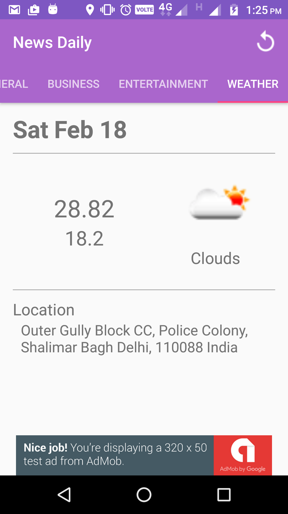
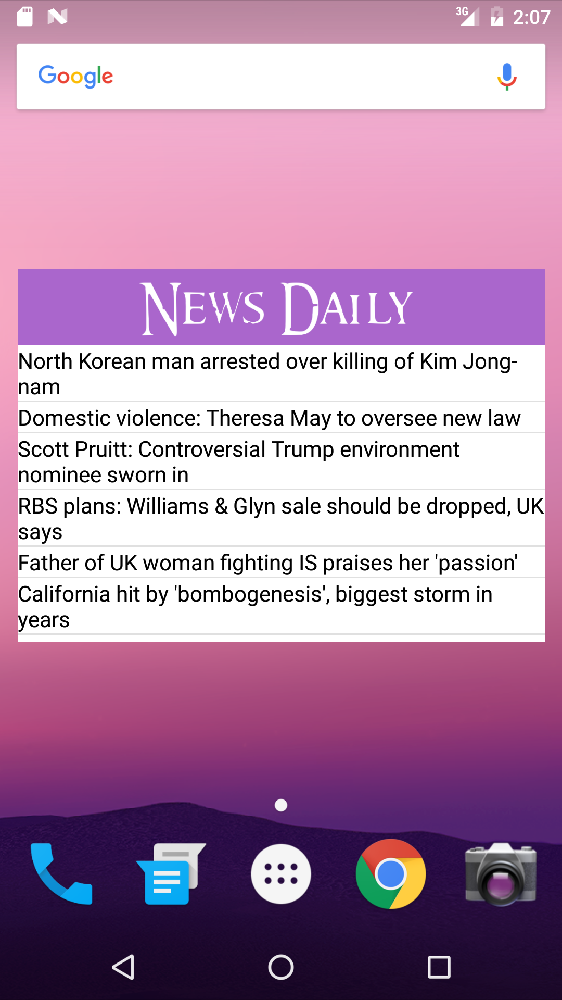
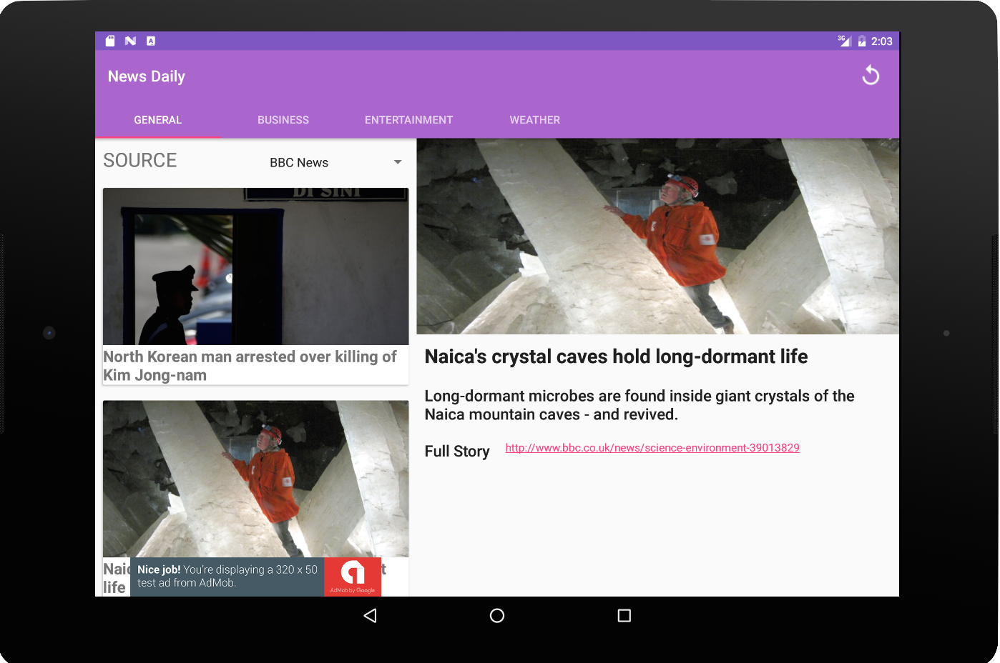

# NewsDaily
An android application for exploring latest news for different categories like general, entertainment, sports, weather etc.

**Features:**

- Discover current news articles and see whats going on around the globe.
- Read news articles of different categories like sports, entertainment, weather etc.
- Remain updated all the time with homescreen widget
- UI optimized for phone and tablet


Screenshots
-----------






Developer setup
---------------

### Requirements

- Java 8
- Latest version of Android SDK and Android Build Tools

### API Key

The app uses [newsapi.org][1] API to get news data and [openweathermap.org][2] API for weather data. You must provide your own API key in order to build the app.

Just put your API keys into `res/values/strings.xml` file 

```
<string name="news_api_key">Your Api Key</string>
<string name="openweather_apikey">Your Api Key</string>
```


[1]: https://newsapi.org
[2]: https://openweathermap.org/api
